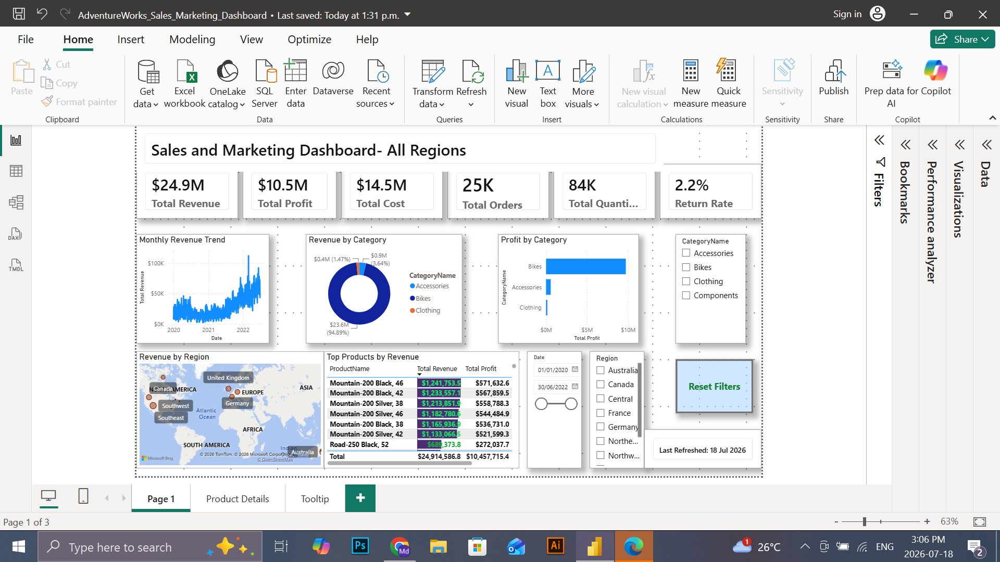
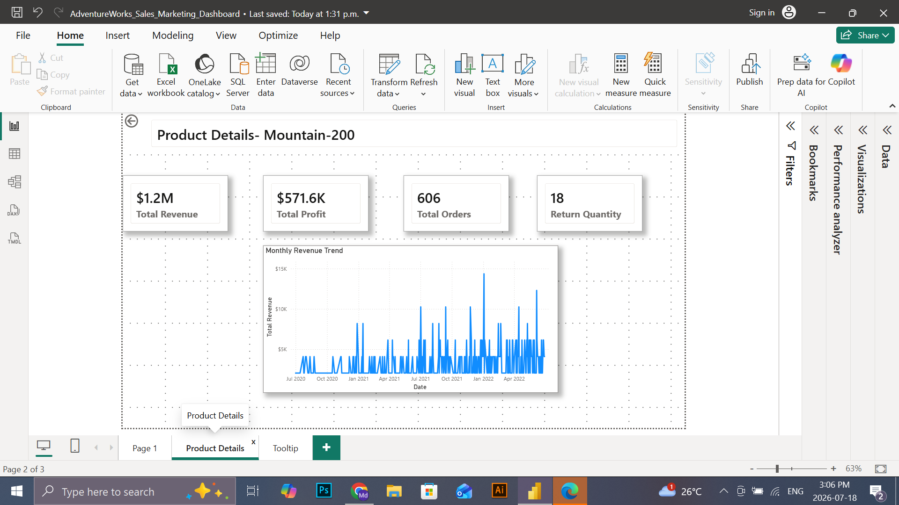
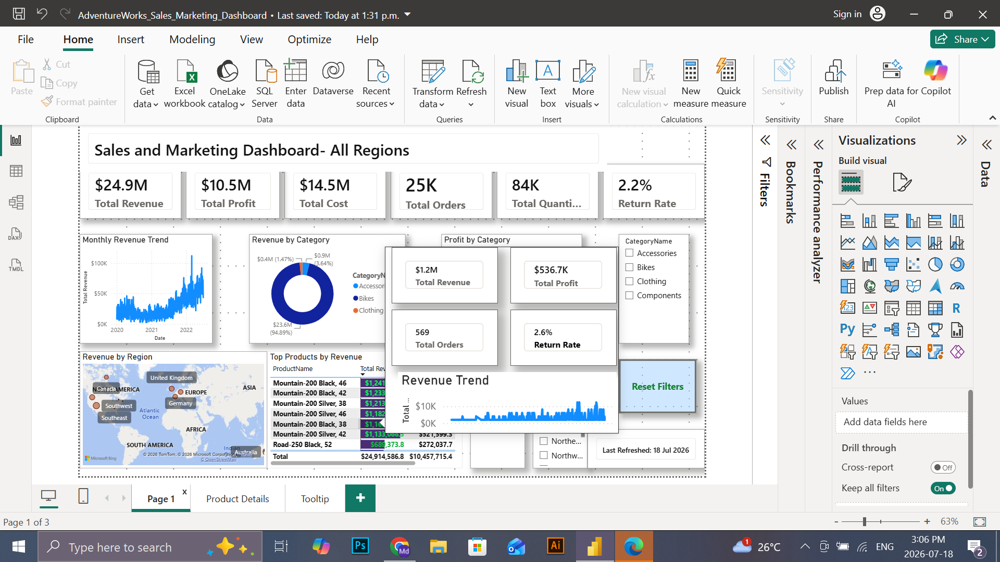

# AdventureWorks Sales & Marketing Dashboard
## Project Overview
This project presents an interactive Sales and Marketing Dashboard developed in Microsoft Power BI using the AdventureWorks dataset.
The dashboard helps business users monitor sales performance, profitability, product performance, regional sales, and product returns through interactive visualizations and drill-through analysis.

Business Objective
The objective of this dashboard is to help decision-makers:
    • Monitor overall sales performance 
    • Analyze product profitability 
    • Compare revenue across product categories 
    • Identify top-performing products 
    • Track regional sales performance 
    • Monitor product return rates 
    • Explore product-level details using drill-through 

Tools & Technologies
    • Microsoft Power BI 
    • Power Query 
    • DAX (Data Analysis Expressions) 
    • AdventureWorks Dataset 

Data Model
The dashboard follows a dimensional data model consisting of:
Fact Tables
    • Sales 
    • Returns 
Dimension Tables
    • Calendar 
    • Customer 
    • Product 
    • Product Category 
    • Product Sub Category 
    • Territory 

Dashboard Features
    • Executive KPI Cards 
    • Monthly Revenue Trend 
    • Revenue by Category 
    • Profit by Category 
    • Revenue by Region Map 
    • Top Products by Revenue 
    • Dynamic Dashboard Title 
    • Interactive Slicers 
    • Conditional Formatting 
    • Drill-through Page 
    • Report Page Tooltip 
    • Reset Filters Button 
    • Last Refresh Indicator 

DAX Measures
Key measures include:
    • Total Revenue 
    • Total Cost 
    • Total Profit 
    • Total Orders 
    • Total Quantity Sold 
    • Return Quantity 
    • Return Rate 

Skills Demonstrated
    • Data Cleaning using Power Query 
    • Data Modeling 
    • Relationship Management 
    • DAX Measure Development 
    • Interactive Dashboard Design 
    • Drill-through Analysis 
    • Report Page Tooltips 
    • Bookmarks 
    • Conditional Formatting 
    • Business Intelligence Reporting 

## Dashboard Preview
### Main Dashboard

### Product Details (Drill-through)

### Report Tooltip

Business Insights
The dashboard enables users to:
    • Monitor company revenue and profitability 
    • Identify best-selling products 
    • Compare product category performance 
    • Analyze regional sales 
    • Monitor return rates 
    • Investigate product performance using drill-through 

Future Enhancements
    • Forecasting 
    • Advanced Time Intelligence 
    • Row-Level Security (RLS) 
    • Power BI Service Deployment 
    • Mobile Dashboard Optimization

Repository Structure 

AdventureWorks-Sales-Marketing-Dashboard/
│
├── README.md
├── AdventureWorks_Sales_Marketing_Dashboard.pbix
├── images/
│   ├── dashboard_AdventureWorks.png
│   ├── drillthrough_AdventureWorks.png
│   └── tooltip_AdventureWorks.png

Author
Md Shariful Islam
## Data Analytics Portfolio Project
## Power BI | SQL | PostgreSQL | Data Visualization 
